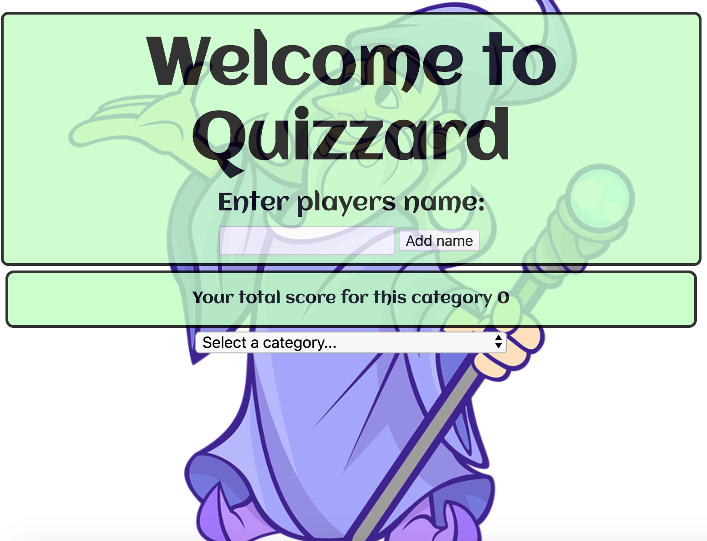
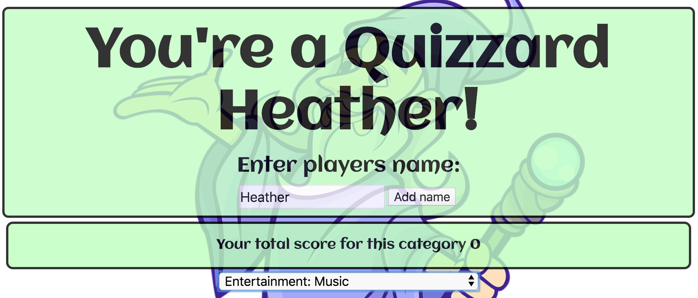
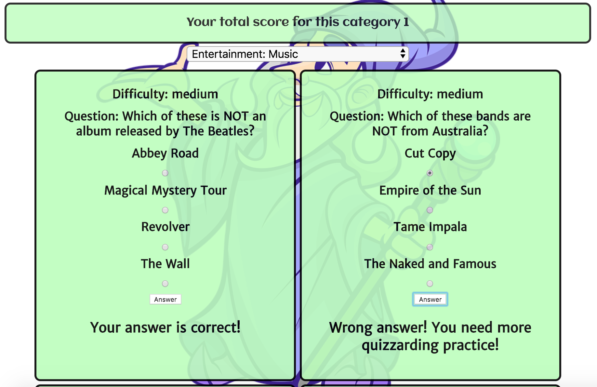

# quizzard

## Project description

A JavaScript Vue solo app using an external API. A quiz game, where you can select a category and answer the questions for that category.

## Build Setup

``` bash
# install dependencies
npm install

# serve with hot reload at localhost:8080
npm run dev

# build for production with minification
npm run build
```

## Screen Grabs


_welcome_


_enter Name_


_play category_

For detailed explanation on how things work, consult the [docs for vue-loader](http://vuejs.github.io/vue-loader).
